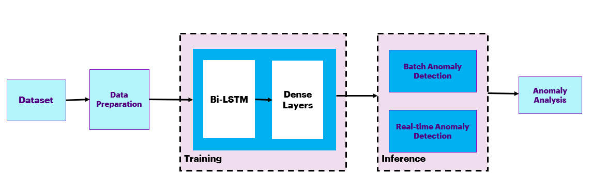
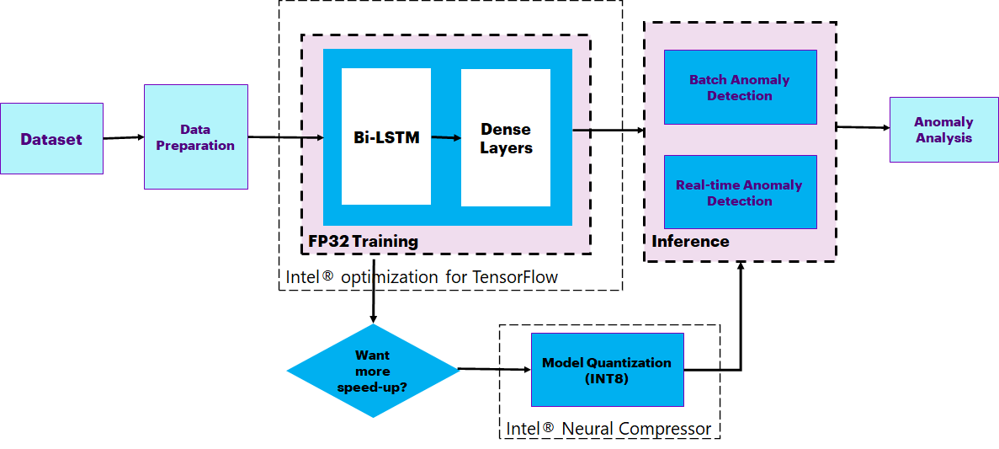
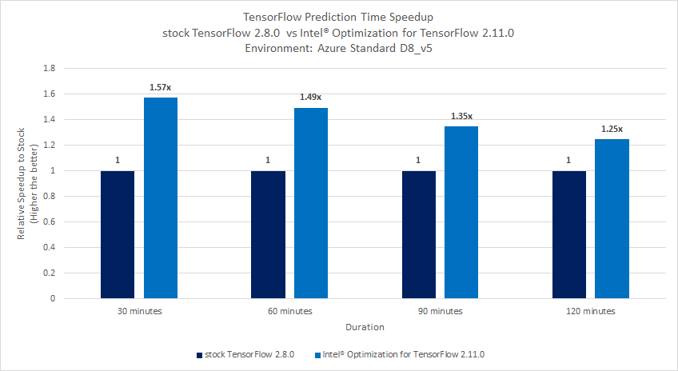

PROJECT NOT UNDER ACTIVE MANAGEMENT

This project will no longer be maintained by Intel.

Intel has ceased development and contributions including, but not limited to, maintenance, bug fixes, new releases, or updates, to this project.  

Intel no longer accepts patches to this project.

If you have an ongoing need to use this project, are interested in independently developing it, or would like to maintain patches for the open source software community, please create your own fork of this project.  

Contact: webadmin@linux.intel.com
# **Data Streaming Anomaly Detection using TensorFlow**
## **Table of Contents**
 - [Purpose](#purpose)
 - [Reference Solution](#reference-solution)
 - [Reference Implementation](#reference-implementation)
 - [Intel® Optimized Implementation](#optimized-e2e-architecture-with-intel%C2%AE-oneapi-components)
 - [Performance Observations](#performance-observations)
 - [Experimental Setup](#experiment-setup)


## Purpose

Anomaly detection has extended applications in various sectors such as manufacturing (fault detection and predictive maintenance), banking and financial services (fraud detection), medicine and healthcare (potential health risk and medical problem identification), cyber-security (intrusion detection in a computer network), and so on.

This capability is critical for building a resilient business. For example, in manufacturing, anomaly detection would allow to optimize operations and energy consumption, minimize equipment downtime, etc., contributing to a reduction in overall operational cost. Detecting anomalous patterns in data can lead to significant actionable insights and give chance to take corrective measures before the issue is widespread.

Organizations build applications that deal with streaming data from machine control systems, sensors, meters, mobile phones, social media, etc. to process massive amounts of data as it is generated. Machine operators, process engineers, reliability engineers, operations staff, sales and marketing teams, banking professionals, etc. increasingly rely on these applications to give them real-time information so as to carry out their daily jobs effectively.

In industrial IOT use case scenarios, the equipment will be connected to multiple sensors counting to hundreds and thousands for condition monitoring. The sensors will record measurements of various parameters of equipment such as temperature, voltages, power, vibration, sound, device-specific parameters. Real-time processing of such massive amount of data to derive actionable insights is critical. With the rising IOT implementation, use of AI/ML to deploy data streaming services on the cloud is useful, however, it introduces undesirable latency resulting in a delayed response.

Data streaming services powered by AI/ML algorithms are compute-intensive. For the solution to be truly effective, it needs to be deployed on edge devices that facilitate instantaneous actionable insights. With the limited processing power at the edge, it is essential that resources are used optimally to meet the business requirements for streaming analytics.

## Reference Solution

- This reference kit leverages Intel® oneAPI to demonstrate the deep learning model using TensorFlow to help detect the anomalies in data collected from IOT Devices to monitor equipment condition and prevent any issue from being cascaded in the entire operation flow.

- The goal is to categorize the sensor data values streaming from the IOT Devices into anomalous or normal. A deep learning architecture with Bi-LSTM and Dense layers is used for detecting anomalous data from the input data-stream. Bi-LSTM is highly beneficial to learn sequences with patterns of unknown length. The number of sensor values varies to a large extent. Thus, the Bi-LSTM model will have an advantage in these scenarios. The model takes multiple sensor values which are synthetically generated based on the given period of time and time interval. This trained model can then be used to predict if the sensor values are anomalous or normal.

- In order to demonstrate efficient utilization of underlying resources when deployed on edge devices with low processing and memory capabilities, the model is quantized from FP32 to INT8 model, while maintaining a similar level of accuracy as the FP32 model.

## Key Implementation Details

- Highlighted the performance gain using Intel® oneAPI packages especially, Intel® Optimization for TensorFlow 2.11.0 over the stock version of TensorFlow 2.8.0.

- The input sensor values are synthetically generated using statistical methods and then pre-processed to perform feature extraction using PCA (Principal Component Analysis) technique.

- The extracted features are then fed to the Bi-LSTM model to learn the normal data and anomalous data. The inference time and the model accuracy are captured for multiple runs on both the stock version and the Intel® OneAPI version. Averages of the runs are calculated, and a comparison is provided.

- The model has been quantized using Intel® Neural Compressor which has shown high-performance vectorized operations on Intel® platforms.


## Reference Implementation

### E2E Architecture



### Dataset

| **Use case** | Data Streaming Anomaly Detection
| :--- | :---
| **Object of interest** | Data Anomaly Detection
| **Size** | Total 500K Samples<br>
| **Train : Test Split** | 80:20 (400K samples for training and 100K for testing)
| **Source** | Synthetically Generated Dataset


### Synthetic Data preparation
Note: Generating synthetic data is a part of this reference kit's pipeline execution but is not a part of the analysis and benchmarking as 
it is just the pre-requisite step in the pipeline to have the data.

**Pre-requisite:** To create the required dataset for benchmarking, follow the guide in the data directory [here](https://github.com/oneapi-src/data-streaming-anomaly-detection/blob/main/data/README.md)

The details of sample synthetic dataset generated for a specific time with 10 features is given below. 
The parameters - period of time and number of features, are configurable during the generation of data. The generated timestamp 
and the 10 feature values can be thought of as values read from sensors at a particular instance of time given by timestamp.

- `timestamp` : date and time when the sensor data was collected
- `sensor01, sensor02 to sensor10`: reading of sensor 1, reading of sensor 2,... reading of sensor 10

The target or output feature value indicates if the sample is an anomaly (1) or normal data (0).

Treated as a time series data, this provides a view of sensor values at each timestamp.

>Note: Since synthetic data was utilized for development, timestamp is not considered a trainable feature here.

#### Dataset split for training and validation
Run the script gen_datasetfiles.py in the root directory to generate the training and testing datasets.
```sh
python src/gen_datasetfiles.py --dataset_file ./data/synData.csv
```

where synData.csv is the name of the synthetically generated file.

The files train.csv, test.csv will be generated in the current directory.

Move these files into "data" folder.
```sh
mv train.csv ./data/
mv test.csv ./data/
```

>Note: In this reference kit the synthetic dataset generated with below parameters is used for benchmarking.
<br>mean = 12, number of features = 150, Fraction of anomalies = 1

The dataset thus generated had 500K samples, out of which a split of 80:20 was used so that 400K samples were
used for training and 100K samples were used for testing.

### Expected Input-Output

**Input**                                 | **Output** |
| :---: | :---: |
| Timestamp and Sensor Data Values        | Anomalous Data or Normal Data |

### **Input**
The input dataset consists of time series sensor data. Each sample is identified by below features.
1. Timestamp
2. Sensor 01 Value
3. Sensor 02 Value <br>
...<br>
30. Sensor 10 Value

<b>Example:</b>

|**Timestamp**    |01-10-2019 00:00 |
| :---          | :--- |
|Sensor 01   | 3.298792084 | 
|Sensor 02   | 41.79860947 |
|Sensor 03   | 63.73827071 |
|Sensor 04   | 35.70667732 |
|Sensor 05   | 48.70083891 |
|Sensor 06   | 44.82665387 |
|Sensor 07   | 111.608341 |
|Sensor 08   | 49.03588996 |
|Sensor 09   | 47.60286125 |
|Sensor 10   | 7.875516215 |

### **Expected Output**
For the given input timestamp and sensor data values, the expected output will be if this data is anomalous or normal. 

<b>Example:</b>

|**Output**       | |
| :---          | :---
|0		        |Normal Data
|1	      | Anomalous Data


### Software Requirements
Note that this reference kit implementation already provides the necessary scripts to setup the software requirements. 
1. Python - 3.9.x
2. TensorFlow - 2.8.0

> **Note**: If you are beginning to explore the reference kits on client machines such as a windows laptop, go to the 
[Running on Windows](#running-on-windows) section to ensure you are all set and come back here.

> **Note**: The performance measurements were captured on Xeon based processors. The instructions will work on WSL, 
however some portions of the ref kits may run slower on a client machine, so utilize the flags supported to modify the 
epochs/batch size/duration to run the training or inference faster. Additionally performance claims reported may not be seen on a 
windows based client machine.

> **Note**: In this reference kit implementation already provides the necessary conda environment configurations to setup the software requirements. 
To utilize these environment scripts, first install Anaconda/Miniconda by following the instructions at the following link: 
> [Anaconda installation](https://docs.anaconda.com/anaconda/install/linux/)

###  For cloning the repository  please execute below 
First clone the repository executing the below command.
```
git clone https://github.com/oneapi-src/data-streaming-anomaly-detection
```

### Reference Solution setup
The below commands can be used to automate the creation of a conda environment for execution of the algorithms.

>Note: It is assumed that the present **working directory is the root directory of this code repository.**

```sh
conda env create --file env/stock/anomalydetection_stock.yml
```

This command utilizes the dependencies found in the `env/stock/anomalydetection_stock.yml` file to create an environment as follows:

**YAML file**                                 | **Environment Name** |  **Configuration** |
| :---: | :---: | :---: |
| `env/stock/anomalydetection_stock.yml`             | `anomalydetection_stock` | Python=3.9.7 with TensorFlow 2.8.0

For the workload implementation to arrive at first level solution we will be using the stock environment.

Use the following command to activate the environment that was created:
```sh
conda activate anomalydetection_stock
```

### Reference Solution implementation

#### Model building process
The Python script given below needs to be executed to start training using the 
active environment enabled by using the above steps to setup the environment. 

The script will run the benchmarks with the parameters passed to it and displays the corresponding 
training time in seconds. The details of the script and parameters are given below.

Execute the Python script as given below to start training the given dataset file.
```shell
usage: run_modeltraining.py [-h] [-s SAVE_MODEL_DIR] [-i INTEL] [-b BATCH_SIZE] [-bf16 BF16]

optional arguments:
  -h, --help            show this help message and exit
  -s SAVE_MODEL_DIR, --save_model_dir SAVE_MODEL_DIR
                        directory to save model to
  -i INTEL, --intel INTEL
                        Enable this flag for intel model inference. Default is 0
  -b BATCH_SIZE, --batch_size BATCH_SIZE
                        training batch size
  -bf16 BF16, --bf16 BF16
                        use 1 to enable bf16 capablities, default is 0
```
<b>Note:</b> 
1) The 'save_model_dir' parameter is mandatory to run the script while other parameters are optional.
2) 'help' option will give the details of the arguments.

<b>Example</b>: 
```shell
python src/run_modeltraining.py --batch_size 128 --save_model_dir "./models/stock" --intel 0
```
This command runs the model using batch size of 128 for stock environment
and saves the trained model in <i>"./models/stock/" </i> folder and 
subsequently, displays the training time of the model. The user can collect the logs by 
redirecting the output to a file as illustrated below.

```shell
python src/run_modeltraining.py --batch_size 128 --save_model_dir "./models/stock" --intel 0 | tee <log_file_name>
```

The output of the python script <i>run_modeltraining.py</i> will be collected in the file <log_file_name>

**Expected Output**

Output would be generated by the Python script <i>run_modeltraining.py</i> which will capture the overall training time in seconds.
The output can be redirected to a file as per the command above.

The lines below are from the sample output of the python script <i>run_modeltraining.py</i> and it gives details of training the model.

    ----------------------------------------
    # Model Training 
    # Time (in seconds): 27.922860383987
    # Model saved path: ./models/stock/
    ----------------------------------------

### Running Inference

The above script will train and save models to the `save_model_dir`.  To use this model to make predictions on new data, 
a 2-step process is necessary to optimize performance.  

1. Convert the saved model from a Keras saved model to a TensorFlow frozen graph.  To do this, we provide a utility script 
`convert_keras_to_frozen_graph.py` which takes the following arguments:

```shell
usage: convert_keras_to_frozen_graph.py [-h] -s KERAS_SAVED_MODEL_DIR -o OUTPUT_SAVED_DIR

optional arguments:
  -h, --help            show this help message and exit
  -s KERAS_SAVED_MODEL_DIR, --keras_saved_model_dir KERAS_SAVED_MODEL_DIR
                        directory with saved keras model.
  -o OUTPUT_SAVED_DIR, --output_saved_dir OUTPUT_SAVED_DIR
                        directory to save frozen graph to.
```

>Note: A frozen model graph is a binary file that contains both the model's architecture and its learned weights, in a format that is optimized for inference. It can be loaded into a TensorFlow runtime for efficient execution on a target device, without the need for additional compilation or optimization steps.

For the above saved model, we would run the command:

```shell
python src/convert_keras_to_frozen_graph.py -s ./models/stock -o ./models/stock
```
which **takes in the saved Keras model** and outputs a **frozen graph** in the same directory called `./models/stock/saved_frozen_model.pb`.

2. Once a saved frozen graph is saved, this model can now be used to perform inference using the `run_inference.py` script 
which has the following arguments:

```shell
usage: run_inference.py [-h] [-s SAVED_FROZEN_MODEL] [-i INTEL] [-d DURATION] [--benchmark_mode BENCHMARK_MODE] [-n NUM_ITERS] [-bf16 BF16]

optional arguments:
  -h, --help            show this help message and exit
  -s SAVED_FROZEN_MODEL, --saved_frozen_model SAVED_FROZEN_MODEL
                        saved frozen graph.
  -i INTEL, --intel INTEL
                        Enable this flag for intel model inference. Default is 0
  -d DURATION, --duration DURATION
                        Duration in Minutes
  --benchmark_mode BENCHMARK_MODE
                        benchmark inference time with respect to 'num_iters', default will be on entire test dataset
  -n NUM_ITERS, --num_iters NUM_ITERS
                        number of iterations to use when benchmarking
  -bf16 BF16, --bf16 BF16
                        use 1 to enable bf16 capablities, default is 0
```

The inference will run on the test.csv file stored in the data folder.

```shell
python src/run_inference.py --saved_frozen_model ./models/stock/saved_frozen_model.pb --duration 30 --benchmark_mode True -n 10 --intel 0
```

**Expected Output**

Output would be generated by the Python script <i>run_inference.py</i> which will capture the overall inference time in seconds.
The output can be redirected to a file as per the command above.

The lines below from the sample output of the python script run_inference.py and it gives details of inference of the model

    ----------------------------------------
    # Model Inference details:
    # Average inference:
    #   Time (in seconds): 0.007241064
    #   Sensor Data Duration : 30
    ----------------------------------------

## **Optimizing the Reference solution using libraries from the Intel AI Analytics Toolkit**

The reference solution architecture for an Intel-optimized pipeline is largely unchanged except the execution using Intel® Optimization for TensorFlow.<br>



The **expected output** for the optimized reference solution is also similar to what we observed for the stock pipeline except for the accelerated inference times. 
This will be discussed more in the section - [Performance Observations](#performance-observations).

### Optimized Software Components
Intel® Optimization for TensorFlow

Intel® is collaborating with Google* to optimize its performance on platforms based on the Intel® Xeon® processor. The platforms 
use the Intel® oneAPI Deep Neural Network Library (oneDNN), an open-source, cross-platform performance library for deep-learning 
applications. These optimizations are directly up streamed and made available in the official TensorFlow (as of v2.11.0), which enables 
developers to seamlessly benefit from the Intel® optimizations.

The latest version of Intel® Optimization for TensorFlow* is included as part of the Intel® oneAPI AI Analytics Toolkit (AI Kit). 
This kit provides a comprehensive and interoperable set of AI software libraries to accelerate end-to-end data science and 
machine-learning workflows.

Intel® Neural Compressor

Intel® Neural Compressor is an open-source Python* library designed to help you quickly deploy low-precision inference solutions 
on popular deep-learning frameworks such as TensorFlow*, PyTorch*, MXNet*, and ONNX* (Open Neural Network Exchange) runtime. 
The tool automatically optimizes low-precision recipes for deep-learning models to achieve optimal product objectives, 
such as inference performance and memory usage, with expected accuracy criteria.

1. Python - 3.9.x
2. Intel® Optimization for TensorFlow - 2.11.0
3. Intel® Neural Compressor - 1.14.2

### ***Optimized Solution setup***
Follow the below conda installation commands to setup the Intel environment along with the necessary packages for this model training and prediction.
>Note: It is assumed that the present working directory is the root directory of this code repository

```shell
conda env create --file env/intel/anomalydetection_intel.yml
```
>Note:
If while creating the environment if the error "command 'gcc' failed: No such file or directory" occurs then,
install gcc using the command below:
```sh
sudo apt-get install gcc
```
This command utilizes the dependencies found in the `env/intel/anomalydetection_intel.yml` file to create an environment as follows:

**YAML file**                                 | **Environment Name** |  **Configuration** |
| :---: | :---: | :---: |
| `env/intel/anomalydetection_intel.yml`             | `anomalydetection_intel` | Python=3.9.x with Intel® Optimization for TensorFlow 2.11.0

For the workload implementation to arrive at first level solution we will be using the intel environment.

Use the following command to activate the environment that was created:
```shell
conda activate anomalydetection_intel
```

>Note: Use the following FLAGS for training and inference with intel environment.

```
export OMP_NUM_THREADS=2
export KMP_AFFINITY=granularity=fine,compact,1,0
export KMP_BLOCKTIME=1
export KMP_SETTINGS=TRUE
```

#### **Model building process with Intel® optimization**
The python script <i>run_modeltraining.py<i> used for training on stock version is used for training the model on Intel environment also
as per example below.

<b>Example</b>: 
```shell
python src/run_modeltraining.py --batch_size 128 --save_model_dir "./models/intel" --intel 1
```
This command runs the model with batch size of 128, using dataset file <i>train.csv</i>, for intel environment
and saves the trained model in <i>"./models/intel/" </i> folder and subsequently, outputs the training time of the model. 
The user can collect the logs by redirecting the output to a file as illustrated below.

```shell
python src/run_modeltraining.py --batch_size 128 --save_model_dir "./models/intel" --intel 1 | tee <log_file_name>
```

The output of the python script <i>run_modeltraining.py<i> will be collected in the file <log_file_name>

The **run_modeltraining.py** script also includes a command line flag --bf16 which enables bf16 mixed precision training (on CPUs that support it) along with the optimizations.

The training process for Intel® Optimization for TensorFlow along with bf16 mixed precision training can be enabled using the **run_modeltraining.py** script as:

>**Note**: You can enable bf16 training by setting the bf16 flag as shown below. Please note that this flag MUST be enabled only on Intel® Fourth Gen Xeon® Scalable processors codenamed Sapphire Rapids that has bf16 training support and optimizations to utilize AMX, the latest ISA introduced in this family of processors.

```sh
python src/run_modeltraining.py --batch_size 128 --save_model_dir "./models/intel" --intel 1 --bf16 1
```

**Expected Output**<br>
Output would be generated by the Python script <i>run_modeltraining.py</i> which will capture the overall training time in seconds.
The output can be redirected to a file as per the command above.

The lines below are from the sample output of the python script <i>run_modeltraining.py</i> and it gives details of training the model.

    ----------------------------------------
    # Model Training 
    # Time (in seconds): 9.922860383987
    # Model saved path: ./models/intel/
    ----------------------------------------

#### **Model Inference process with Intel® optimization**
Similar to stock version training, the 2 steps for running the inference script (saving a frozen graph and running inference) is identical.  
We can run the below commands:

```shell
python src/convert_keras_to_frozen_graph.py -s ./models/intel -o ./models/intel
python src/run_inference.py --saved_frozen_model ./models/intel/saved_frozen_model.pb --duration 30 --benchmark_mode True -n 10 --intel 1
```

>**Note**: You can enable bf16 inference by setting the bf16 flag as shown below. Please note that this flag MUST be enabled only on Intel® Fourth Gen Xeon® Scalable processors codenamed Sapphire Rapids that has bf16 training support and optimizations to utilize AMX, the latest ISA introduced in this family of processors.

```shell
python src/run_inference.py --saved_frozen_model ./models/intel/saved_frozen_model.pb --duration 30 --benchmark_mode True -n 10 --intel 1 --bf16 1
```

#### Post Training Optimization with Intel® Neural Compressor

In scenarios where size of the model or data become very large, it may be desirable to further optimize the latency and throughput of the model.  
The model quantization technique via Intel® Neural Compressor can be used to optimize such models.

Model quantization is the practice of converting the FP32 weights in Deep Neural Networks to a 
lower precision as INT8, **to accelerate computation time and reduce storage
space of trained models**.  Intel® offers multiple algorithms and packages for quantization of trained models.  In this reference implementation, we 
include a script, `run_quantize_inc.py` which can be executed only after saving the frozen graph to attempt 
accuracy-aware quantization on the trained model.

The `run_quantize_inc.py` script takes the following arguments:

```shell
usage: run_quantize_inc.py [-h] --saved_frozen_graph SAVED_FROZEN_GRAPH --output_dir OUTPUT_DIR --inc_config_file INC_CONFIG_FILE

optional arguments:
  -h, --help            show this help message and exit
  --saved_frozen_graph SAVED_FROZEN_GRAPH
                        saved pretrained frozen graph to quantize
  --output_dir OUTPUT_DIR
                        directory to save quantized model.
  --inc_config_file INC_CONFIG_FILE
                        INC conf yaml
```

which can be used as follows:

```shell
python src/run_quantize_inc.py --saved_frozen_graph ./models/intel/saved_frozen_model.pb --output_dir ./models/intel --inc_config_file env/config.yaml
```

and outputs a quantized model, if successful, to `./models/intel/saved_frozen_int8_model.pb`. 

Inference on this newly quantized model can be performed as below.

```shell
python src/run_inference.py --saved_frozen_model ./models/intel/saved_frozen_int8_model.pb --duration 30 --benchmark_mode True -n 10 --intel 1
```

**Expected Output**

Output would be generated by the Python script <i>run_inference.py</i> which will capture the overall inference time in seconds.
The output can be redirected to a file as per the command above.

The below lines are the sample output of the python script <i>run_inference.py</i>.

    ----------------------------------------
    # Model Inference details:
    # Average inference:
    #   Time (in seconds): 0.004960537
    #   Sensor Data Duration : 30
    ----------------------------------------

## Performance Observations
This section covers the inference time comparison between stock TensorFlow 2.8.0 and Intel® Optimization for TensorFlow 2.11.0. 


<br>**Key Takeaway**<br>
- Intel® Optimization for TensorFlow 2.11.0 offers batch inference time speed-up upto 1.57x compared to stock 
TensorFlow 2.8.0 for different batch sizes.

#### **Conclusion**
Streaming data can be used for automation, recommendations, and decision-making. IoT sensors are increasingly instrumenting the physical 
world, and efforts have been made to use AI for solving these tasks also in low-quality data regimes. Detecting anomalous patterns in data can 
lead to significant actionable insights in a wide variety of application domains.

To build a solution for data-streaming anomaly detection using the Deep Learning approach, data scientists will need to train the models with substantial large datasets and run inference more frequently. They would need to derive actionable insights from the model predictions. This requires a lot of training and retraining, making their job tedious. The ability to accelerate training will allow them to train their models more frequently to achieve better accuracy. Additionally, faster inference will allow them to run predictions in real-time scenarios more frequently. Thus, speeding up the entire DL pipeline.

This reference kit implementation provides a performance-optimized guide around data streaming anomaly detection use cases that can easily be scaled across similar use cases in various domains.

**Note on Performance Gain:**

 The performance gain is dependent on multiple factors such as hardware infrastructure, hyperparameters, trained model, data size and 
 structure etc. The hardware chosen here is a typical VM configuration that customers use and the rest of the parameters are choices 
 governed by the dataset as well as the computational capability. Changing any of these, which users are free to do, will change the 
 performance numbers. The main objective of this reference kit is to demonstrate that a deep learning model using 
 Intel optimized packages will speedup that process. The presented results confirm that.


## Notices & Disclaimers
Performance varies by use, configuration, and other factors. Learn more on the [Performance Index site](https://edc.intel.com/content/www/us/en/products/performance/benchmarks/overview/). 
Performance results are based on testing as of dates shown in configurations and may not reflect all publicly available updates.  
See backup for configuration details. No product or component can be secure. Your costs and results may vary. Intel technologies 
may require enabled hardware, software or service activation.<br>
© Intel Corporation. Intel, the Intel logo, and other Intel marks are trademarks of Intel Corporation or its subsidiaries. Other names and 
brands may be claimed as the property of others.

To the extent that any public or non-Intel datasets or models are referenced by or accessed using tools or code on this site those datasets or models are provided by the third party indicated as the content source. Intel does not create the content and does not warrant its accuracy or quality. By accessing the public content, or using materials trained on or with such content, you agree to the terms associated with that content and that your use complies with the applicable license.
 
Intel expressly disclaims the accuracy, adequacy, or completeness of any such public content, and is not liable for any errors, omissions, or defects in the content, or for any reliance on the content. Intel is not liable for any liability or damages relating to your use of public content.


## Appendix

### Experiment Setup
- **Date Testing Performed:** January 2023
- **Configuration Details and Workload Setup:** Azure D8v5 (Intel® Xeon® Platinum 8370C CPU @ 2.80GHz), 1 Socket, 4 Cores per Socket, 
2 Threads per Core, Turbo:On, Total Memory: 32 GB, OS: Ubuntu 20.04, Kernel: Linux 5.15.0-1019-azure, Software: Intel® oneAPI Optimization for TensorFlow v2.11.0, TensorFlow 2.8.0, 
Intel® Neural Compressor 1.14.2
- **Testing performed by** Intel Corporation

| Platform                          | Microsoft Azure: Standard_D8_v5 (Ice Lake)<br>Ubuntu 20.04
| :---                              | :---
| Hardware                          | Azure Standard_D8_V5
| CPU cores                         | 8
| Memory                            | 32GB
| Software                          | Intel® oneAPI Optimization for TensorFlow v2.11.0, Intel® Neural Compressor v1.14.2 <br>
| What you will learn               | Intel® oneAPI performance advantage over the stock packages

**Operating System:**
We recommend using a Linux OS for executing the reference solution presented here, e.g. RHEL or Ubuntu.

### Known Issues

1. Environment Creation Issue : Could not build wheels for pycocotools

    **Issue:**
      When creating an intel environment using `anomalydetection_intel` 
      ```
      error: command 'gcc' failed: No such file or directory
      ERROR: Could not build wheels for pycocotools
      ```

    **Solution:**

    Install gcc.  For Ubuntu, this will be: 

      ```bash
      apt install gcc
      ```

2. ImportError: libGL.so.1: cannot open shared object file: No such file or directory
   
    **Issue:**
      While running the script "python src/run_quantize_inc.py":,
      ```
      ImportError: libGL.so.1: cannot open shared object file: No such file or directory
      or
      libgthread-2.0.so.0: cannot open shared object file: No such file or directory
      ```

    **Solution:**

      Install the libgl11-mesa-glx and libglib2.0-0 libraries. For Ubuntu this will be:

      ```bash
     sudo apt install libgl1-mesa-glx
     sudo apt install libglib2.0-0
      ```

###Running on Windows
The reference kits commands are linux based, in order to run this on Windows, goto Start and open WSL and follow the same steps as running on a 
linux machine starting from git clone instructions. If WSL is not installed you can <a href="https://learn.microsoft.com/en-us/windows/wsl/install" rel="nofollow"> install WSL

> **Note**: If WSL is installed and not opening, goto Start ---&gt; Turn Windows feature on or off and make sure Windows Subsystem for Linux is checked. 
Restart the system after enabling it for the changes to reflect.
